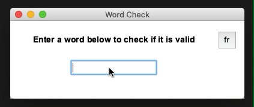
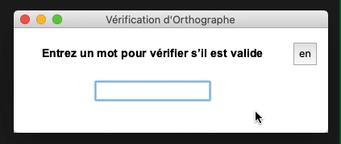

# Word Checker
A GUI tool to check if a word is valid. Available in English & French. 

Underlying data structure: **trie**

To start the tool, run
```
$ python3 FrontEnd.py
```

## Demo
**English**    


**French**    


**Switching languages**    



## Word Source
English: https://github.com/dwyl/english-words    
French: https://www.freelang.com/download/misc/liste_francais.zip
